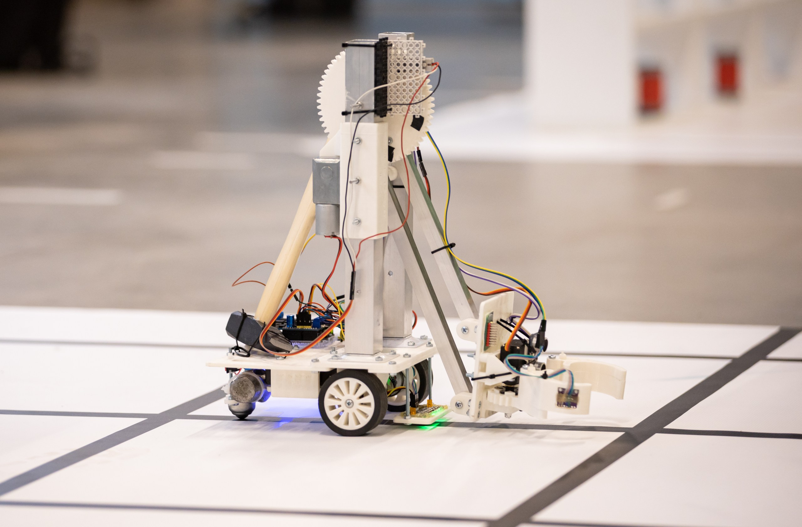

# IRS-1
IRS-1 - Intelligent (mobile) robotic systems

## Описание проекта:
Цель проекта IRS - создание различных экспериментальных роботов для выполнения различных интеллектуальных задач в области мобильной робототехники. 

## История участия в соревнованиях:
1) Изначально робот создан для участия в соревновании "роботизированное производство" на международном фестивале Робофинист-2024;
2) Модифицирован для участия в соревновании "Кубок-РТК - высшая лига" на международном фестивале Робофинист-2025.

## Описание робота:
1) Робот почти полностью смоделирован в САПР T-Flex Student, элементы шестеренок были смоделированы в САПР Kompas 3D Student
2) При создании конструкции робота использовались металлические профили и 3D печать PLA
3) Электроника: контроллер Arduino Uno + BTS7960 PRO (см. одноименный репозиторий) + различные сенсоры
4) Питание: АКБ 18650 + DC-DC понижающий стабилизатор
Интеллектуальный робот, смоделированный в CAD и распечатанный на 3D принтере. Робот двигается за счет двух моторов постоянного тока, которые расположены спереди. Для устойчивости на роботе установлена шаровая опора. В качестве сенсоров используется линейка ИК датчиков от производителя iarduino. В качестве контроллера используется Arduino UNO и моторшилд собственной разработки - BTS7960PRO. Управляющая программа была написана на Си подобном языке в среде Arduino IDE, и там же скомпилирована и зашита в контроллер. Для захвата объектов используется манипулятор, для движений которого используется мотор, в редуктор которого встроена червячная передача. В захват, который приводится в движение за счет сервопривода, встроены даультразвуковой датчик и датчик цвета, для детекции банок.

